# Auction Price Prediction

This was a one-day team case study to predict auction prices of heavy farming equipment. It demonstrates the main aspects of regression analysis.

The data set was challenging. There are many categorical features with low incidence. A significant amount of numerical features values are missing. Nonetheless we were able to create a regression model which performed somewhat better than simply predicting the mean. A comprehensive solution the problem would certainly require more complete data.

Our unitial regression model performed reasonable well. We achieved a RMSE of ~$15,599 compared to the standard deviation of the prices in the data set of ~$23,037. The residual plots and QQ plot led to question to quality of fit and explore regularized options:

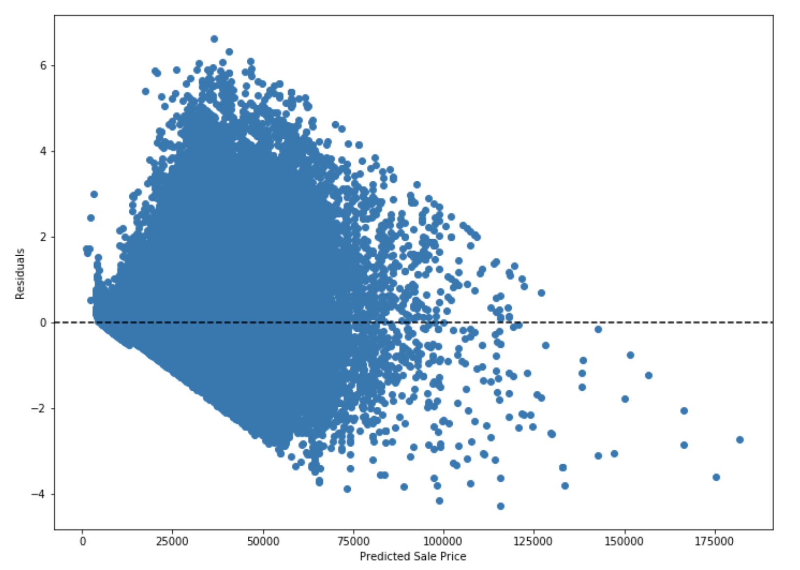
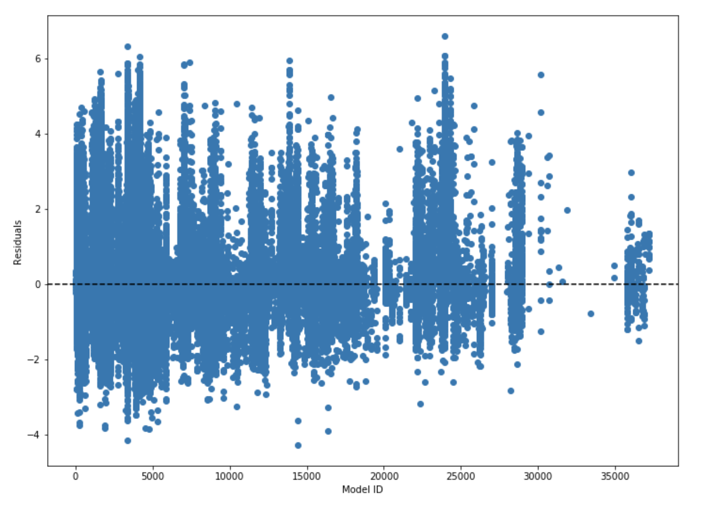
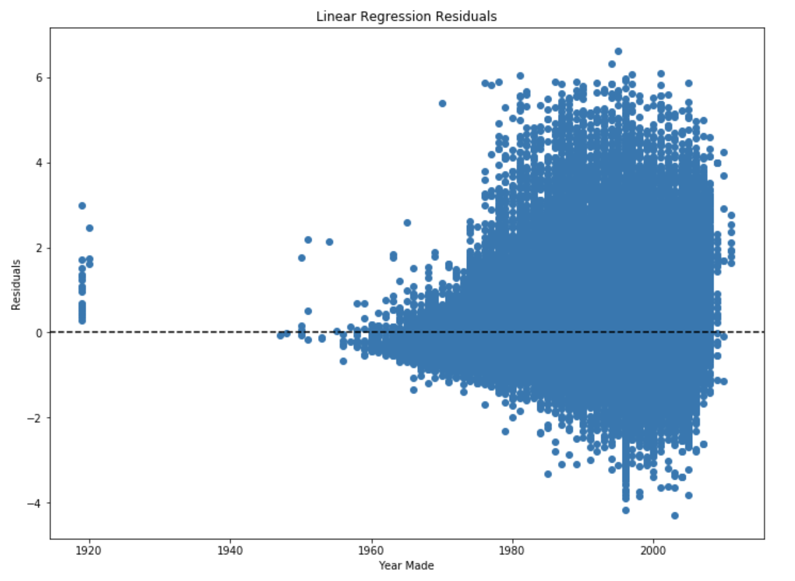
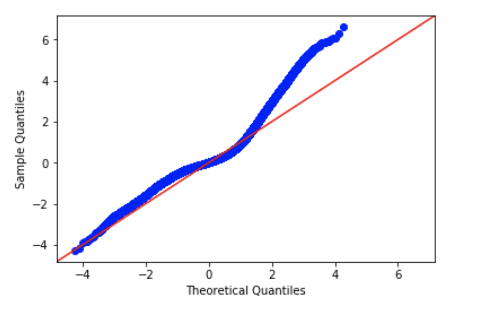

The improve the model we performed Recursive Feature Elimination with Cross-Validation to limit the feature space and reduce multicolinearity. Given that the base model was a regression analysis and the dataset was not huge, it was feasable though expensive to run this analysis.  

One the feature space was reduced we trained Ridge and Lasso Regression model and inspected the results.

## Ridge
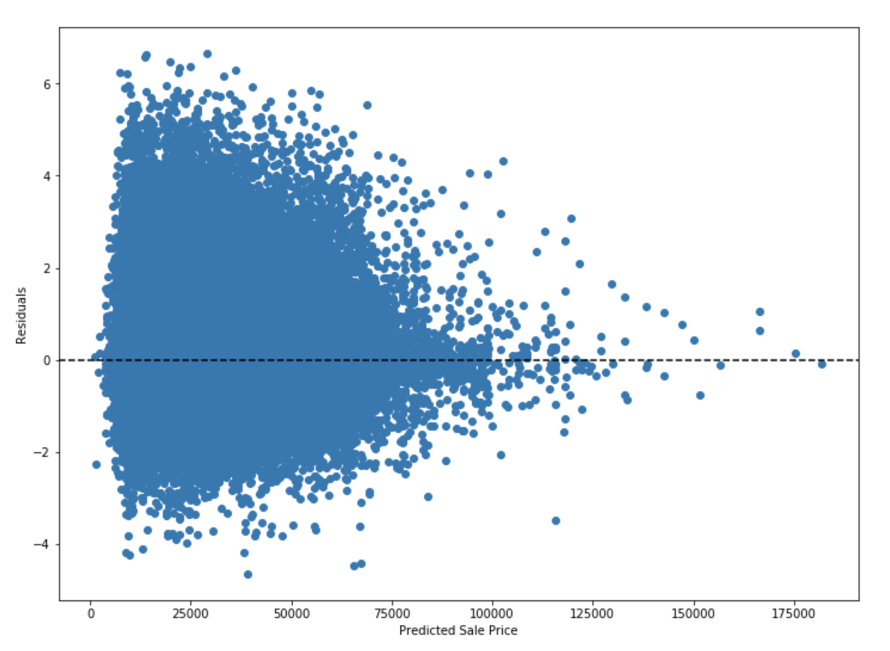
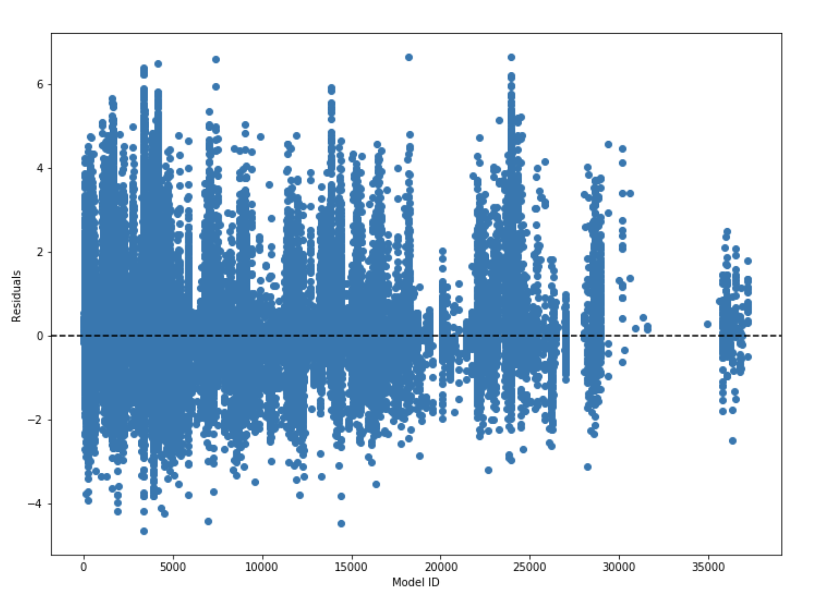
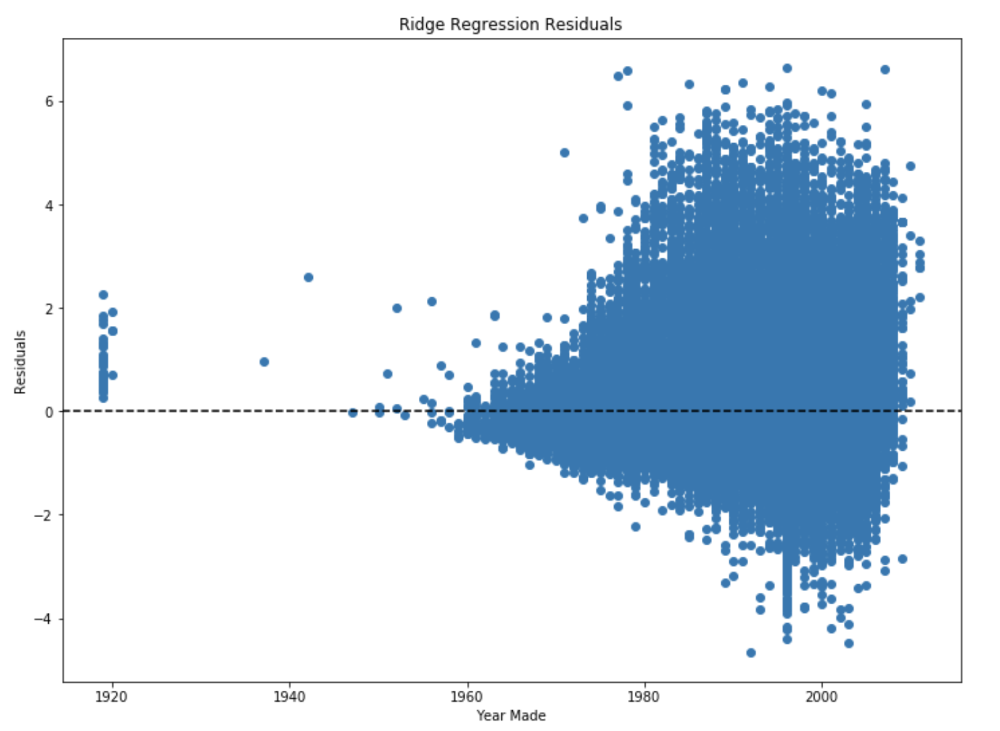
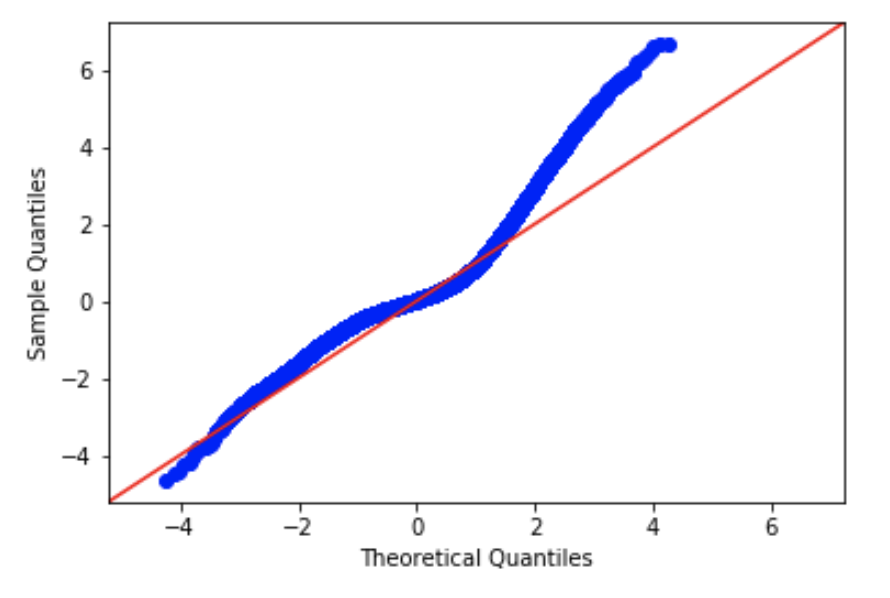

## Lasso
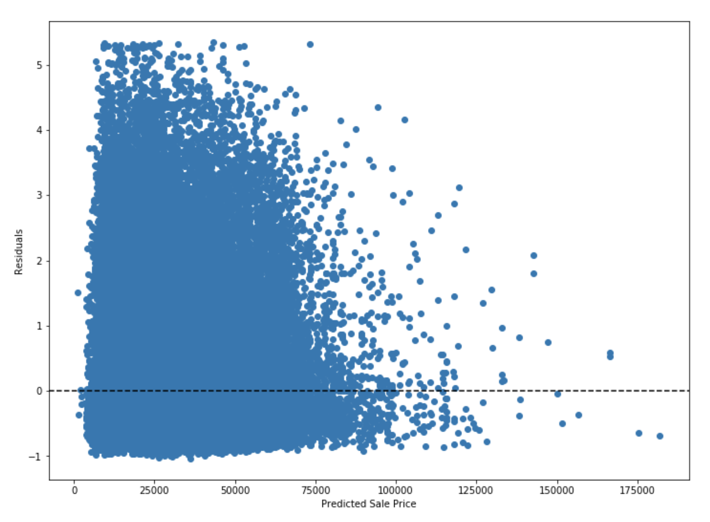
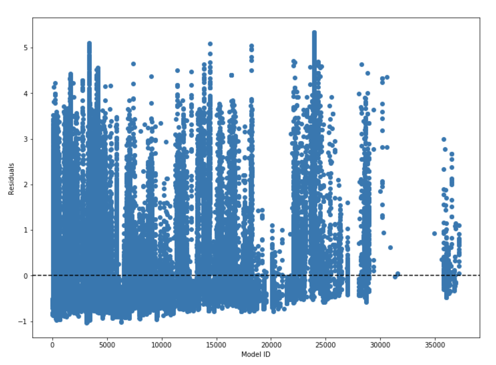
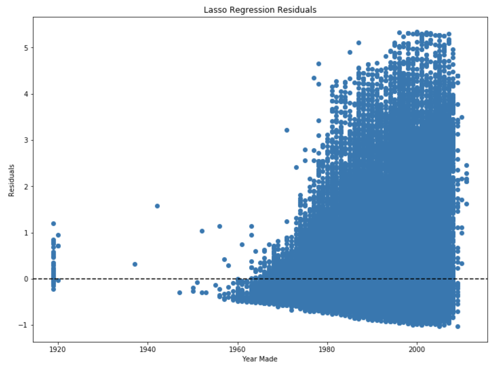
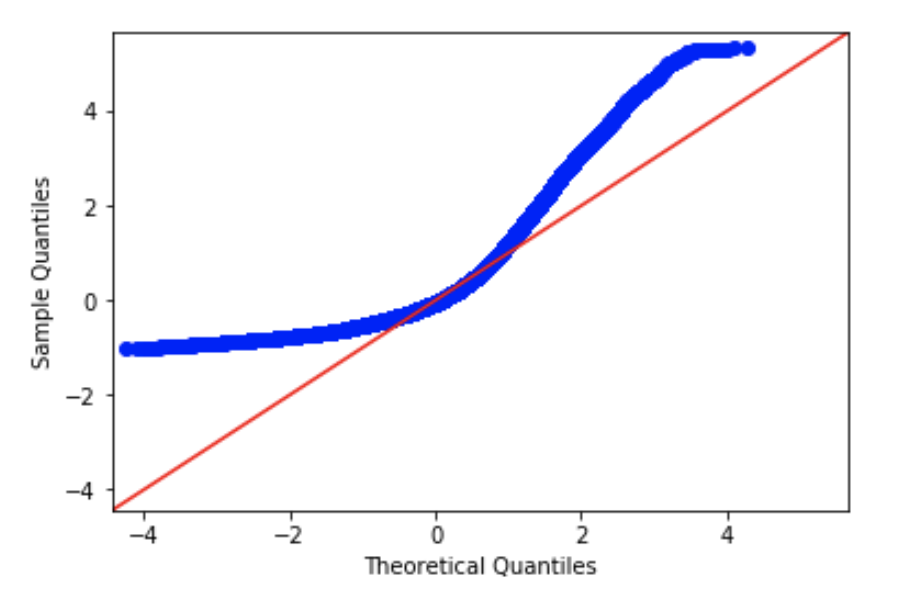

## Conclusion
Each linear model has its strengths with this dataset. After acquiring better data, it would be worthwhile to explore tree-based models to find a potential non-linear solution. In the meantime, the Ridge regresssion appears to offer a minimum viable solutions.
